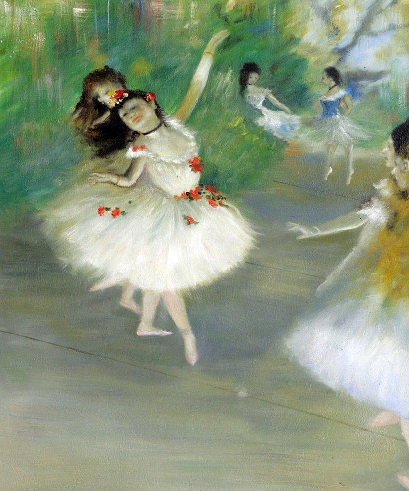

# Deep Gaze 2 & ICF - Saliency Prediction

> **Copyright Disclaimer**: the following code is adapted from https://deepgaze.bethgelab.org/ 
> © Copyright 2016 by [Matthias Kümmerer](http://www.bethgelab.org/).

## Getting started

### Requirements

- Docker image:
    ```
    docker pull tensorflow/tensorflow
    ```
- Python 3.6 + Tensorflow
- Python requirements: see ``requirements.txt``

### Tutorials
- `Demo.ipynb` 
- `CreateCenterbias.ipynb`

## Results


|Input | Deep Gaze II | | ICF | |
|---|---|---|---|---|
||||||
||||||
||||||
||||||
||||||
||||||
||||||
||||||
||||||


